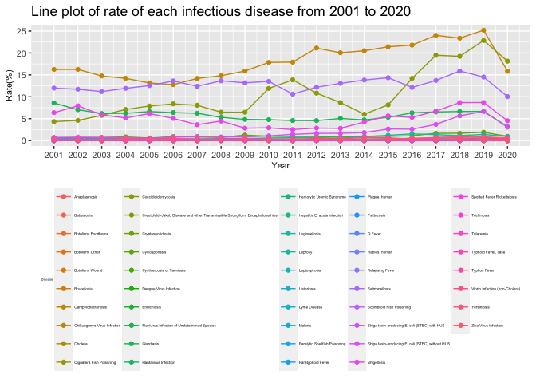
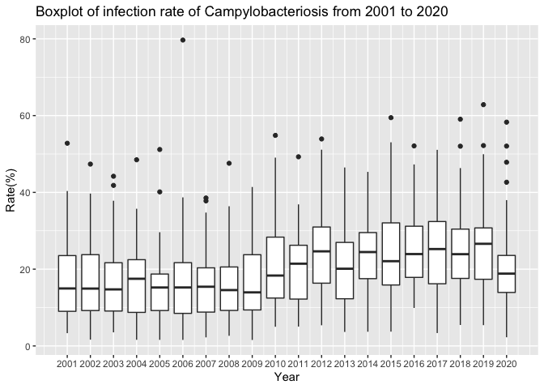
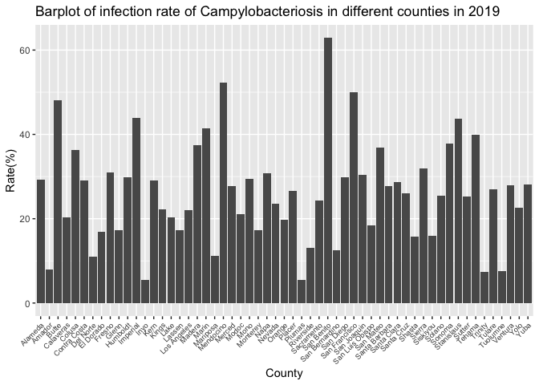
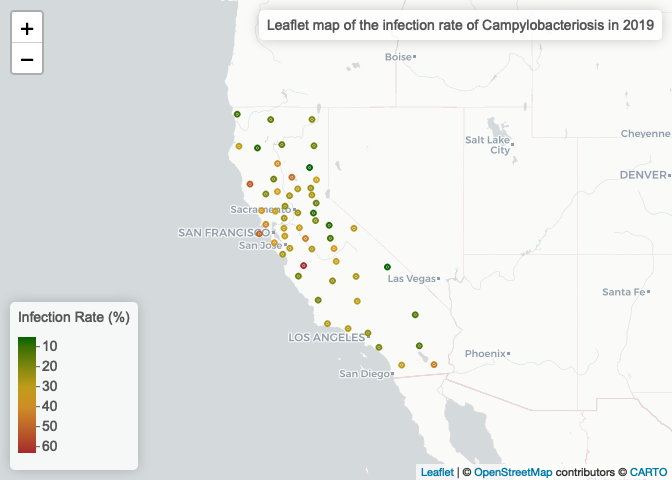

Infectious Diseases by Disease, County, Year, and Sex
================
Qiushi Peng
2022-10-23

Import libraries

``` r
library(data.table)
library(dplyr)
```

    ## 
    ## Attaching package: 'dplyr'

    ## The following objects are masked from 'package:data.table':
    ## 
    ##     between, first, last

    ## The following objects are masked from 'package:stats':
    ## 
    ##     filter, lag

    ## The following objects are masked from 'package:base':
    ## 
    ##     intersect, setdiff, setequal, union

``` r
library(ggplot2)
```

# Introduction

The dataset, called *Infectious Diseases by Disease, County, Year, and
Sex*, is downloaded from [California Health and Human Services Open Data
Portal](https://data.chhs.ca.gov/).

This dataset contains case counts and rates by disease, county, year,
and sex for selected infectious diseases that met the surveillance case
definition in California. There are 9 columns in the dataset: *Disease*,
*County*, *Year*, *Sex*, *Cases*, *Population*, *Rate*,
*Lower_95\_\_CI*, and *Upper_95\_\_CI*. There are 167,974 rows. The data
represent cases with an estimated illness onset date from 2001 through
the last year indicated from California Confidential Morbidity Reports
and/or Laboratory Reports. Data captured represent reportable case
counts as of the date indicated in the “Temporal Coverage” section
below, so the data presented may differ from previous publications due
to delays inherent to case reporting, laboratory reporting, and
epidemiologic investigation.

After looking at the whole dataset, we formed two questions: We would
like to know the infectious diseases with the highest prevalence, and in
which year the diseases had a highest infection rate. In that year, did
the diseases spread evenly across the whole state? Is there a
significant difference in infection rates between males and females?

# Methods

### 1. Data acquisition

Data was downloaded from
“<https://data.chhs.ca.gov/dataset/infectious-disease>”.

``` r
diseases <- data.table::fread("odp_idb_2020_ddg_compliant.csv")
```

Geographical data was downloaded from
“<https://public.opendatasoft.com/explore/dataset/us-county-boundaries/export/?disjunctive.statefp&disjunctive.countyfp&disjunctive.name&disjunctive.namelsad&disjunctive.stusab&disjunctive.state_name&refine.stusab=CA>”.

``` r
CA_geo <- data.table::fread("us-county-boundaries.csv")
CA_geo <- CA_geo[,.(NAME, INTPTLAT, INTPTLON)]
```

### 2. Data cleaning and wrangling

Merge *diseasaes* and *CA_geo*.

``` r
diseases <- 
  merge(x = diseases,
      y = CA_geo,
      by.x = "County",
      by.y = "NAME",
      all.x = TRUE,
      alL.Y = FALSE)
```

The dataset has 6 columns. Among them, columns “Cases” and “Rate” have
several missing values because of “Scoring Criteria” prevent them from
being publicated. Thus, we can remove them.

Remove NA rows.

``` r
diseases <- filter(diseases, !is.na(Cases))
diseases$Rate[which(diseases$Rate == "-")] <- NA
diseases$Rate[which(diseases$Rate == "-")] <- NA
diseases <- filter(diseases, !is.na(Rate))
```

The data type of column “Rate” is *chr*, which we do not want it to be.
Thus, we change the data type to *num*.

``` r
diseases[ , Rate := gsub("\\*", "", Rate)]
diseases[ , Rate := as.numeric(Rate)]
```

The “County” column includes rows called “California”, which is the
state not a county, so we delete them. We saved the aggregate
“California” data into a new variable “Cal”.

``` r
Cal <- diseases[County == "California"]
diseases <- diseases[County != "California"]
```

# Preliminary Results

### Summary Table

``` r
table_sex <- Cal[ , .(
  NumofDiseases = length(Cases),
  Cases_avg = round(mean(Cases, na.rm = TRUE)),
  Cases_sd = sd(Cases, na.rm = TRUE),
  Rate_avg = mean(Rate, na.rm = TRUE),
  Rate_sd = sd(Rate, na.rm = TRUE)
  ), by = .(Year, Sex)]
knitr::kable(table_sex, col.names = c("Year", "Sex", "Count of Diseases", "Cases Avg", "Cases SD", "Rate Avg", "Rate SD"))
```

| Year | Sex    | Count of Diseases | Cases Avg |  Cases SD | Rate Avg |  Rate SD |
|-----:|:-------|------------------:|----------:|----------:|---------:|---------:|
| 2010 | Female |                33 |       280 |  721.2064 | 1.493121 | 3.849269 |
| 2010 | Total  |                35 |       599 | 1548.3724 | 1.608657 | 4.156293 |
| 2011 | Female |                35 |       255 |  669.4607 | 1.347200 | 3.533235 |
| 2011 | Male   |                37 |       317 |  859.1431 | 1.689595 | 4.576258 |
| 2011 | Total  |                40 |       520 | 1456.4073 | 1.378425 | 3.860948 |
| 2012 | Female |                38 |       256 |  736.3415 | 1.339368 | 3.849926 |
| 2012 | Male   |                39 |       311 |  862.0373 | 1.638974 | 4.546186 |
| 2012 | Total  |                41 |       536 | 1552.2050 | 1.407951 | 4.075307 |
| 2013 | Female |                37 |       250 |  703.9731 | 1.299622 | 3.654021 |
| 2013 | Male   |                38 |       306 |  826.7953 | 1.601316 | 4.323413 |
| 2013 | Total  |                40 |       536 | 1515.2563 | 1.395600 | 3.947092 |
| 2014 | Female |                34 |       281 |  748.9854 | 1.445471 | 3.857928 |
| 2014 | Male   |                36 |       322 |  839.6155 | 1.670944 | 4.352204 |
| 2014 | Total  |                38 |       573 | 1572.9944 | 1.481316 | 4.063930 |
| 2015 | Female |                33 |       333 |  835.9687 | 1.701939 | 4.274537 |
| 2015 | Male   |                39 |       348 |  898.8099 | 1.790641 | 4.620956 |
| 2015 | Total  |                39 |       632 | 1673.0009 | 1.620667 | 4.288898 |
| 2016 | Female |                36 |       327 |  815.8107 | 1.660472 | 4.146697 |
| 2016 | Male   |                40 |       381 |  990.1014 | 1.944175 | 5.056574 |
| 2016 | Total  |                41 |       660 | 1741.9735 | 1.680268 | 4.437598 |
| 2017 | Female |                42 |       334 |  895.9890 | 1.686452 | 4.528398 |
| 2017 | Male   |                43 |       427 | 1146.1842 | 2.167233 | 5.817424 |
| 2017 | Total  |                43 |       755 | 2017.9861 | 1.910721 | 5.110320 |
| 2018 | Female |                40 |       385 |  968.5417 | 1.939375 | 4.874162 |
| 2018 | Male   |                39 |       493 | 1200.2316 | 2.489077 | 6.061918 |
| 2018 | Total  |                41 |       846 | 2118.3376 | 2.133293 | 5.339772 |
| 2019 | Female |                41 |       403 | 1026.8203 | 2.024537 | 5.156120 |
| 2019 | Male   |                39 |       525 | 1299.3127 | 2.643667 | 6.546857 |
| 2019 | Total  |                41 |       904 | 2291.5611 | 2.274634 | 5.763299 |
| 2020 | Female |                36 |       298 |  768.9392 | 1.493000 | 3.858071 |
| 2020 | Male   |                38 |       342 |  893.3602 | 1.720474 | 4.500278 |
| 2020 | Total  |                41 |       580 | 1587.1061 | 1.457293 | 3.989424 |
| 2005 | Female |                32 |       246 |  575.8256 | 1.360469 | 3.183616 |
| 2005 | Male   |                33 |       298 |  680.6407 | 1.663515 | 3.802820 |
| 2005 | Total  |                36 |       504 | 1225.4000 | 1.399250 | 3.405184 |
| 2006 | Male   |                34 |       301 |  695.2255 | 1.669588 | 3.856451 |
| 2006 | Total  |                37 |       499 | 1234.2062 | 1.375784 | 3.404998 |
| 2007 | Female |                32 |       247 |  600.5414 | 1.342406 | 3.268665 |
| 2007 | Male   |                33 |       297 |  690.9014 | 1.632030 | 3.800240 |
| 2007 | Total  |                36 |       498 | 1246.5595 | 1.363056 | 3.410330 |
| 2008 | Male   |                31 |       316 |  725.0317 | 1.722193 | 3.955284 |
| 2008 | Total  |                32 |       566 | 1360.7600 | 1.534781 | 3.692082 |
| 2009 | Female |                32 |       248 |  644.6026 | 1.330875 | 3.459468 |
| 2009 | Male   |                34 |       287 |  708.7938 | 1.557794 | 3.842854 |
| 2009 | Total  |                36 |       498 | 1310.8356 | 1.342194 | 3.535432 |
| 2001 | Female |                30 |       259 |  615.2508 | 1.496167 | 3.548187 |
| 2001 | Male   |                31 |       317 |  721.0994 | 1.843871 | 4.199006 |
| 2001 | Total  |                33 |       542 | 1309.5534 | 1.570727 | 3.794365 |
| 2003 | Female |                32 |       232 |  560.0812 | 1.302875 | 3.149590 |
| 2003 | Total  |                35 |       482 | 1191.3046 | 1.361914 | 3.366266 |
| 2004 | Male   |                34 |       277 |  655.6244 | 1.557059 | 3.686448 |
| 2004 | Total  |                36 |       485 | 1202.2932 | 1.355639 | 3.362737 |
| 2006 | Female |                34 |       233 |  582.8317 | 1.279559 | 3.199011 |
| 2008 | Female |                30 |       274 |  666.9355 | 1.481333 | 3.600166 |
| 2010 | Male   |                32 |       362 |  883.3563 | 1.955875 | 4.770420 |
| 2002 | Female |                27 |       298 |  655.5235 | 1.698667 | 3.734204 |
| 2002 | Male   |                31 |       315 |  721.0375 | 1.811581 | 4.147735 |
| 2002 | Total  |                32 |       564 | 1337.0065 | 1.615563 | 3.826668 |
| 2003 | Male   |                32 |       288 |  663.4518 | 1.634000 | 3.768226 |
| 2004 | Female |                29 |       267 |  598.2320 | 1.487310 | 3.329347 |

We made a line plot to show rate of each infectious disease from 2001 to
2020.

``` r
ggplot(data = Cal[Sex == "Total"], mapping = aes(x = Year, y = Rate, colour = Disease)) + geom_line() + geom_point() + 
  theme(legend.position = "bottom", legend.text = element_text(size = 3.5), legend.title = element_text(size = 3), 
        axis.text = element_text(size = 8), axis.title = element_text(size = 8)) +
  scale_x_continuous(breaks = seq(2001, 2020, 1)) +
  labs(y = "Rate(%)", title = "Line plot of rate of each infectious disease from 2001 to 2020") 
```

<!-- -->

From the plot, we can see that *Campylobacteriosis*, *Salmonellosis*,
*Giardiasis*, *Shigellosis*, and *Coccidioidomycosis* always have a high
infection rate from 2001 to 2020. We also notice that *Shiga
toxin-producing E. coli (STEC) without HUS* rate has increased a lot
since 2011.

Let’s look further at the disease with the highest infection rate –
*Campylobacteriosis*.

``` r
ggplot() + 
  geom_boxplot(data = diseases[Sex == "Total" & Disease == "Campylobacteriosis"], mapping = aes(y = Rate, x = Year, group = Year)) +
  scale_x_continuous(breaks = seq(2001, 2020, 1)) +
  labs(y = "Rate(%)", title = "Boxplot of infection rate of Campylobacteriosis from 2001 to 2020") 
```

<!-- -->

From the plot, we can see that infection rate of **Campylobacteriosis**
is high in 2019.

Let’s look at the disease in each county in 2019.

``` r
ggplot() + 
  geom_bar(data = diseases[Sex == "Total" & Disease == "Campylobacteriosis" & Year == 2019], mapping = aes(x = County, y = Rate), stat = "identity") +
  theme(axis.text.x = element_text(angle = 45, hjust = 1, size = 7)) +
  labs(y = "Rate(%)", title = "Barplot of infection rate of Campylobacteriosis in different counties in 2019") 
```

<!-- -->

From the plot, we can see that **San Benito** has a highest infection
rate of **Campylobacteriosis** in 2019. Alpine has the lowest infection
rate.

Let see the data in a map view to see if there is a geographical factor
playing a role.

``` r
library(leaflet)
SB_2019 <- diseases[Sex == "Total" & Disease == "Campylobacteriosis" & Year == 2019]
SB_2019_pal <- colorNumeric(c('darkgreen','goldenrod','brown'), domain = SB_2019$Rate)

leaflet(SB_2019) %>% 
  addProviderTiles('CartoDB.Positron') %>% 
  addCircles(
    lat = ~INTPTLAT, lng=~INTPTLON,
    label = ~paste0(Rate), color = ~ SB_2019_pal(Rate),
    opacity = 1, fillOpacity = 1, radius = 500
    ) %>%
  addLegend('bottomleft', pal = SB_2019_pal, values = SB_2019$Rate,
          title = 'Infection Rate (%)', opacity = 1) %>%
  addControl("Leaflet map of the infection rate of Campylobacteriosis in 2019", position = "topright")
```

<!-- -->

We made a table to see that if infection rates are the same for
different genders.

``` r
Camp_County_2019 <- diseases[Disease == "Campylobacteriosis" & County == "San Benito" & Year == 2019][, .(Sex, Cases, Population, Rate)]
knitr::kable(Camp_County_2019)
```

| Sex    | Cases | Population |   Rate |
|:-------|------:|-----------:|-------:|
| Female |    20 |      30943 | 64.635 |
| Male   |    19 |      31108 | 61.078 |
| Total  |    39 |      62051 | 62.852 |

Chi-square test.

``` r
library(stats)
contingency_table <- matrix(c(19,20,31089,30923), nrow = 2, ncol = 2)
chisq.test(contingency_table)
```

    ## 
    ##  Pearson's Chi-squared test with Yates' continuity correction
    ## 
    ## data:  contingency_table
    ## X-squared = 0.00027594, df = 1, p-value = 0.9867

There is not a significant difference between male and female for the
infection rate of Campylobacteriosis in San Benito in 2019 (p = 0.9867).

### Conclusion

1.  *Campylobacteriosis*, *Salmonellosis*, *Giardiasis*, *Shigellosis*,
    and *Coccidioidomycosis* always have a higher infection rate from
    2001 to 2020 than other infectious diseases. *Shiga
    toxin-producing E. coli (STEC) without HUS* infection rate has
    increased significantly a lot since 2011.
2.  *San Benito* had a very high infection rate of *Campylobacteriosis*
    in 2019, which is more than 60%.
3.  There is not a significant difference between male and female for
    the infection rate of Campylobacteriosis in San Benito in 2019.
4.  Counties around San Francisco had a higher infection rate of
    Campylobacteriosis in 2019. Inland area had relatively lower
    infection rate of Campylobacteriosis.

### Reference

1.  California Department of Public Health, Center for Infectious
    Diseases, Infectious Diseases Branch, Surveillance and Statistics
    Section, 2001-2020.
    Infectious-Diseases-by-Disease-County-Year-Sex.csv
